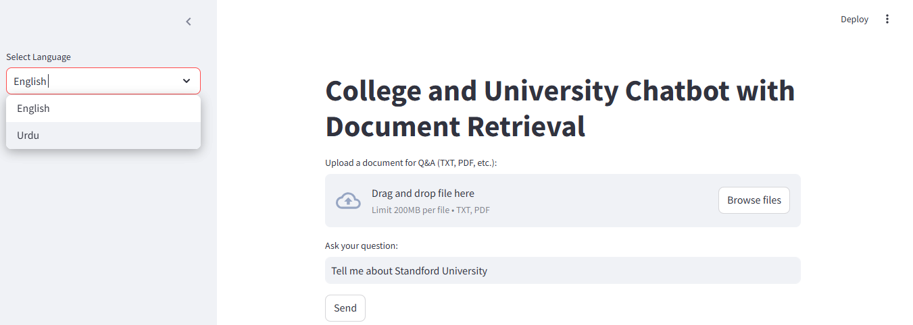

# Multilingual College and University Information Chatbot

This repository contains a **Multilingual Chatbot** built using **LangChain** and **Streamlit** in Python. The chatbot provides answers about colleges and universities, supports multiple languages, and allows users to upload documents for extracting and querying information.

## Screenshot

## Features
- **Multilingual Support**: Interact with the chatbot in various languages, making it accessible to a diverse user base.
- **College and University Information**: Get detailed answers about colleges, universities, courses, and other related queries.
- **Document Upload**: Upload documents (e.g., PDFs, Word files) and query their content for specific information.
- **User-Friendly Interface**: Built using Streamlit, the chatbot features an intuitive and interactive UI.
